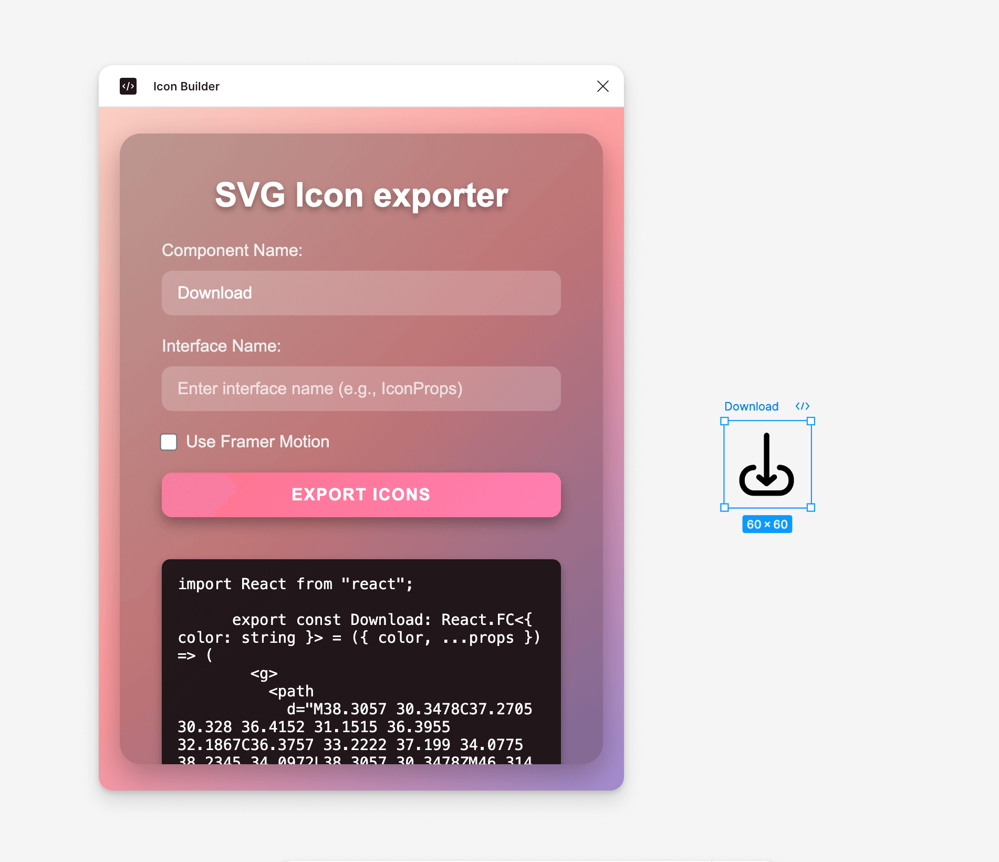

# 🛠️ IconBuilder

<div>
    
</div>

**IconBuilder** is a Figma plugin that helps you turn your frames, components, or instances into reusable components. Whether you're working with React or adding animations with [Framer Motion](https://www.framer.com/motion/), IconBuilder makes the process smooth and efficient. And hey, we're just getting started—future updates will bring support for even more frameworks!

---

## 🚀 Key Features

- **Export Frames as React Components**: Convert your Figma frames into ready-to-use React components.
- **Framer Motion Support**: Add animations to your icons effortlessly.
- **Customizable Names**: Choose your own component and interface names.
- **Code Preview**: See the generated code before exporting.
- **User-Friendly Interface**: Designed to make everything quick and easy.
- **Future-Ready**: Built to support additional frameworks in upcoming versions.

---

## 📦 Installation

1. Clone the repository:

   ```bash
   git clone https://github.com/IvanDF/icon-builder.git
   ```

2. Install dependencies:

   ```bash
   npm install
   ```

3. Build the plugin:

   ```bash
   npm run build
   ```

4. Load the plugin in Figma:

   - Open Figma.
   - Go to `Plugins > Development > Import Plugin from Manifest...`.
   - Select the `manifest.json` file from the project directory.

   ***

## 🛠️ How to Use

1. **Select a Frame**: Choose a frame, component, or instance in your Figma file.
2. **Customize Options**:
   - Enter a name for the component.
   - Define an interface name.
   - Enable or disable Framer Motion support.
3. **Preview the Code**: Click "Show Preview" to see the generated code.
4. **Export**: Click "Export Icons" to download the React component.

---

## 👨‍💻 Author

Created with ❤️ by [IvanDF](https://ivandf.netlify.app).  
Have feedback or want to collaborate? Feel free to reach out!

---

## 📣 Support

If you find IconBuilder helpful, please ⭐ the repository and share it with your network!

[](https://github.com/IvanDF/icon-builder/stargazers)
